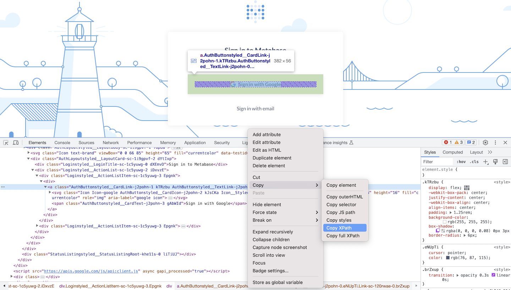

# Refresh Metabase session with Gooogle profile
These scripts will help you update the Metabase session by Signing in with Google and Saving it to Rentry automatically.


## Usage
**Step 1: Create `profile` folder.**

Run the `create_google_profile` script and sign in your Google Account manually in the first time.

*Note: The script is not working for personal Gmail, but working with a Google Workspace account.*

**Step 2: Prepare `metabase.txt` and `rentry.txt`.**

Read the example files.

**Step 3: Refresh the Metabase session.**

Run the `refresh_metabase_session` script to refresh Metabase session automatically. Place the script on your server and set a crontab to schedule for the script.

## Example files
`rentry.txt`

URL id and Edit code.
```text
vk47a3
123456
```

`metabase.txt`

Metabase domain URL and *Sign in with Google* button XPath.
```text
https://your-metabase-domain.com
//*[@id="root"]/div/div[1]/div[2]/div/div[2]/div[1]/div/a
```
How to get *Sign in with Google* button XPath?
- Visit your Metabase.
- Right-click on *Sign in with Google button*, choose *Inspect*.
- Right-click on the element, choose *Copy XPath*.



*Thank for your reading!*